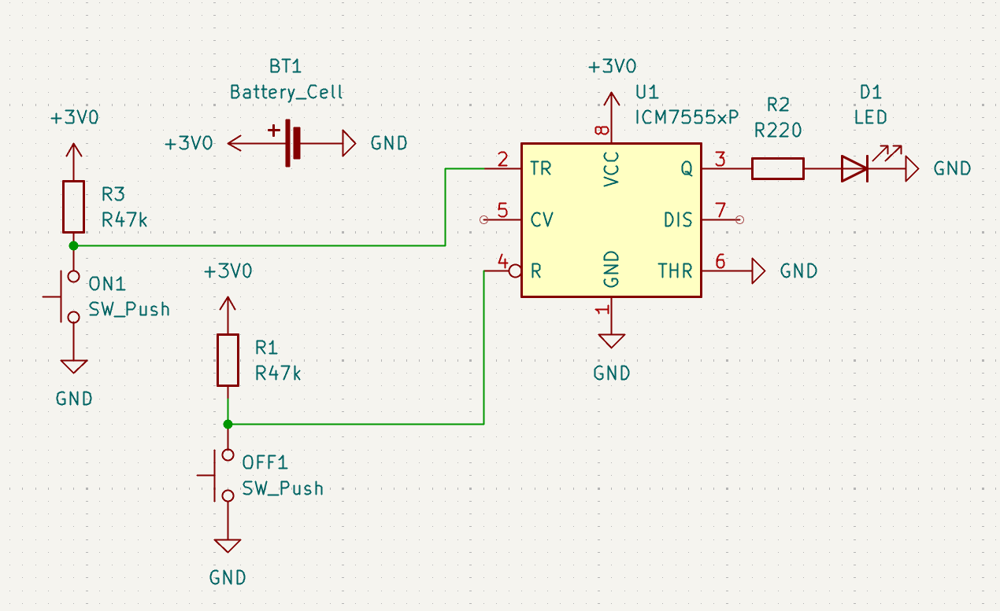
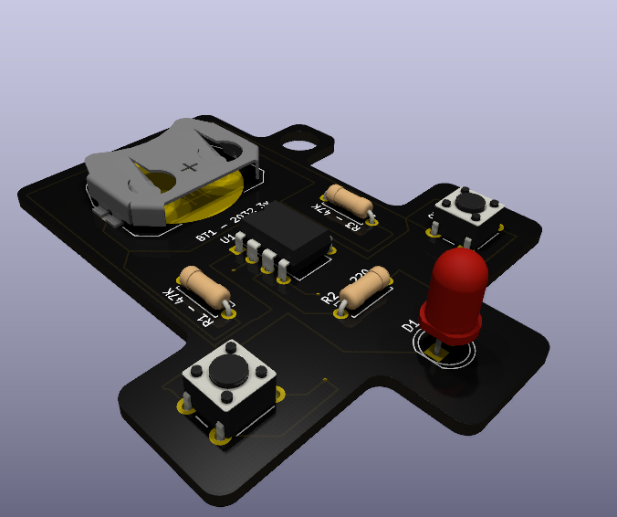
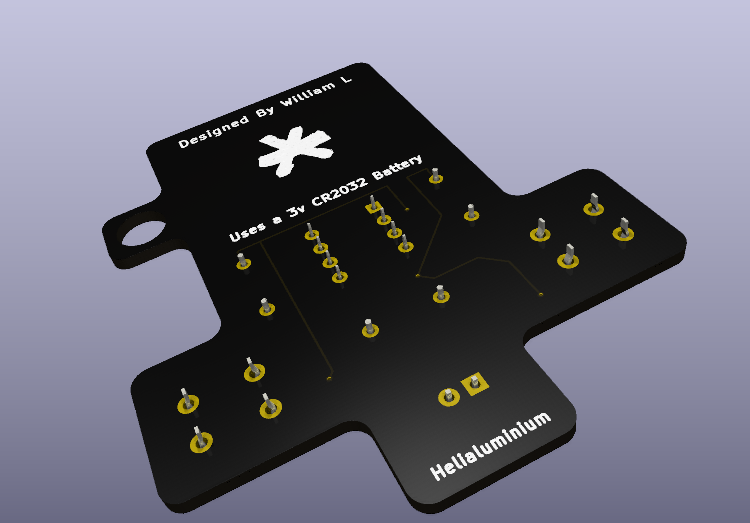

# KeyLight
### A simple keychain light that you can toggle!

## What components are used?
I'm using...
- 1x 555 Timer IC
- 1x 5mm LED
- 2x 47kΩ Resistors
- 1x 220Ω Resistor
- 2x 6mm Push Buttons
- 1x CR2032 Battery Cell Holder
- 1x CR2032 Coin Cell Battery

(you also need a keychain, I've sourced that myself already)

# What does it look like?

### The Schematic

### The PCB Design

### The 3D Model (front and back)

## This project was made by me, William (@william on slack) for Hackclub Solder!
